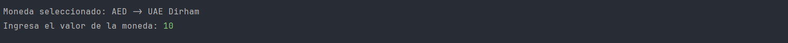

<h1>
<p align="center">
Conversor de Moneda
</p>
</h1>
## Introdución
Programa que realiza conversiones de monedas y guarda un historial de las converciones realizadas anteriormente, utilizando la API de Exchange-RateAPI.

## Tecnologias
- [Exchange-RateAPI](https://www.exchangerate-api.com)
- [Gson](https://mvnrepository.com/artifact/com.google.code.gson/gson/2.11.0)
- [Dotenv java](https://mvnrepository.com/artifact/io.github.cdimascio/dotenv-java/3.0.0)
- [JDK-17](https://www.oracle.com/java/technologies/javase/jdk17-archive-downloads.html)

## Instalación
La instalación y ejecucion es super sencilla solo sigue los pasos acontinuación.
1. Clonar el repositorio.
```bash
git clone https://github.com/JCkingIT/CambioDeMoneda.git
```
2. Verificar si se tiene instalado las librerias nesesarias (Gson, Detenv), verificar las [Tecnologias](#Tecnologias) usadas.
3. Copiamos el archivo .env.example con el nombre .env o tambien lo puedes copiar manualmente (si es que no tienes el archivo .env).
```bash
cp .env.example .env
```
4. Configurar el archivo .env con las credenciales de la api (si no tienes un `KEY` visita [Exchange-RateAPI](https://app.exchangerate-api.com/sign-up) para generar su `KEY` personal) .
```bash
API_URL=https://v6.exchangerate-api.com/v6/
API_KEY=KEY-PERSONAL
```
5. Para ejecutar el programa uvicatse en el archivo `Main.java`  y RUN.

## Qué incluye el proyecto
```
.
|-- src
|   |-- API
|   |   |-- Api.java
|   |   `-- ExchangeRateApi.java
|   |-- config
|   |    `-- Configuracion.java
|   |-- controller
|   |   |-- ConvercionMoneda.java
|   |   |-- ListaMoneda.java
|   |   `-- ListaHistorial.java
|   |-- exepcions
|   |   `-- ExepcionApi.java
|   |-- models
|   |   |-- Moneda.java
|   |   `-- Historial.java
|   |-- records
|   |   |-- CambioEr.java
|   |   |-- ErrorApi.java
|   |   `-- MonedaEr.java
|   |-- utilities
|   |   |-- Fichero.java
|   |   `-- Numero.java
|   |-- views
|   |   `-- Menu.java
|   `-- Mian.java
`-- .env.example
```
Al ejecutar el programa por primera ves se creara dos archivos `JSON`
```
.
|-- src
|   `-- json
|       |-- listaMoneda.json
|       `-- listaHistorial.json
...
```

## Demostración
- Menu principal con tres opciones.

- Menu de Moneda base.

- Valor de moneda base.

- Menu de Moneda camvio.

- Resultado de comverción.

- Ver historial de convercion.
